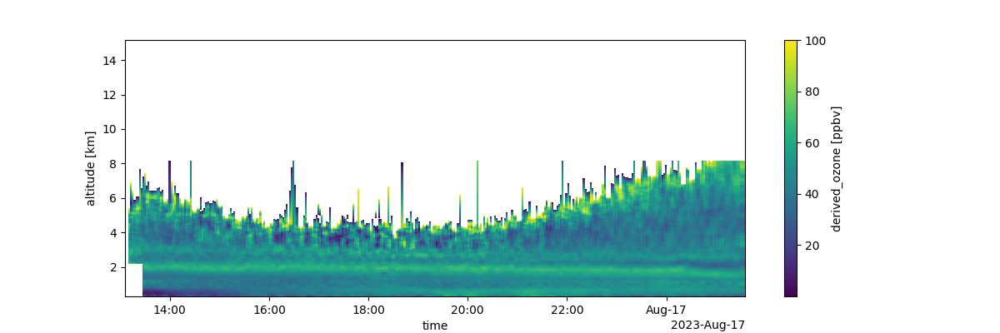

# pytolnet

Python utilities for reading and plotting TOLNet data.

[TOLNet](https://tolnet.larc.nasa.gov/) data provides information on the
vertical evolution of ozone at sites around the country. The recent API makes
accessing the data easier, and this utility provides an interface for the API
to connect TOLNet to [xarray](https://xarray.pydata.org/) and
[pandas](https://pandas.pydata.org/). This simplifies comparison of TOLNet to
other datasets.

To Install:
    python -m pip install --user git+https://github.com/barronh/pytolnet.git

Documentation:

https://barronh.github.io/pytolnet

Example:

    import pytolnet

    api = pytolnet.TOLNetAPI()

    # Find newest data from UAH
    cldf = api.data_calendar('UAH')
    newest_data_id = cldf.index.values[0]

    # Retrieve data
    ds = api.to_dataset(newest_data_id)

    # Print statistics (including coordinates)
    print(ds.to_dataframe().reset_index().describe())
    #                                 time      altitude  derived_ozone
    # count                         174096  174096.00000   63538.000000
    # mean   2023-08-16 19:17:36.874643968       7.72500      48.525455
    # min              2023-08-16 13:06:59       0.30000       0.015444
    # 25%              2023-08-16 16:10:39       4.01250      40.799999
    # 50%              2023-08-16 19:18:37       7.72500      47.500000
    # 75%              2023-08-16 22:24:22      11.43750      55.299999
    # max              2023-08-17 01:31:57      15.15000     100.000000
    # std                              NaN       4.29549      13.209246
    
    # Make a curtain plot
    qm = ds['derived_ozone'].T.plot(figsize=(12, 4))
    qm.figure.savefig('pytolnet.png')

